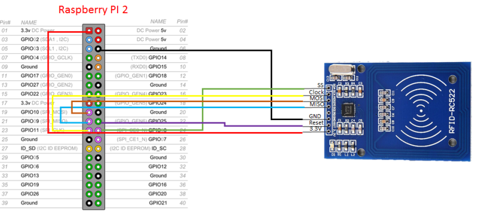
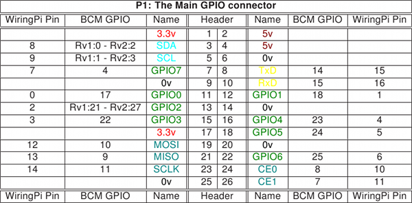
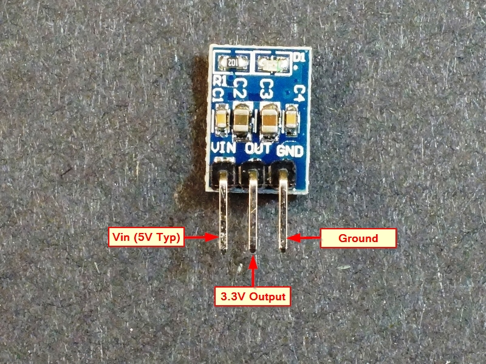
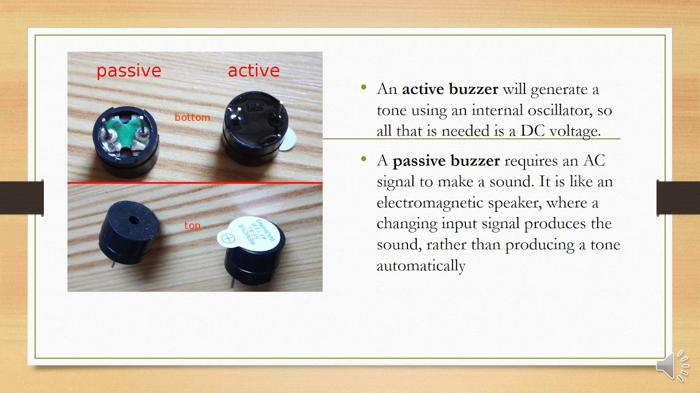
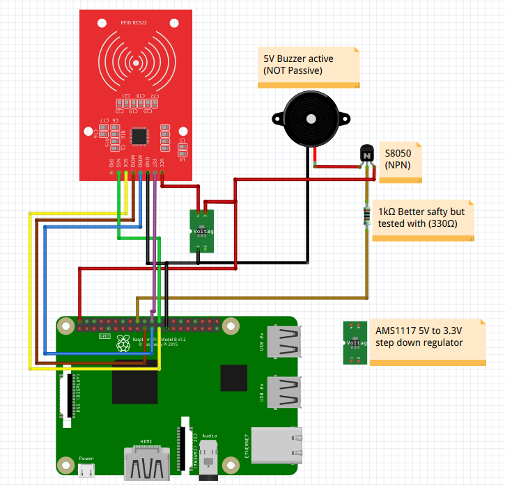

# mfrc522-rpi

:key: JavaScript class to control MFRC522 RFID Module with your Raspberry-pi

MFRC522 is integrated in all types of <b>13.56MHz RFID</b> passive contactless communication methods and protocols.

It uses the ISO14443 specification to communicate to MIFARE cards (also known as <b>NTAG, NFC</b>)
[MIFARE wiki](https://en.wikipedia.org/wiki/MIFARE)
[ISO14443 wiki](https://de.wikipedia.org/wiki/ISO/IEC_14443)

## Features

- Read uid & card memory
- Write card memory & card key
- Buzzer notification (Optional)

## Demo


[Watch on Youtube (with sound)](https://youtu.be/e5D_fy8IIjY)

## Enable SPI

The SPI master driver is disabled by default on Raspbian. To enable it, use raspi-config, or ensure the line dtparam=spi=on isn't commented out in /boot/config.txt. When it is enabled then reboot your pi. If the SPI driver was loaded, you should see the device /dev/spidev0.0

[more info about SPI](https://www.raspberrypi.org/documentation/hardware/raspberrypi/spi/README.md)

## Install

[](https://badge.fury.io/js/mfrc522-rpi)

```
npm install mfrc522-rpi
```

## [node-rpio Compatibility](https://github.com/jperkin/node-rpio/blob/master/README.md#compatibility)

* Raspberry Pi Models: A, B (revisions 1.0 and 2.0), A+, B+, 2, 3, 3+,
  3 A+, 4, Compute Module 3, Zero.
* Node.js Versions: 0.8, 0.10, 0.12, 4, 5, 6, 7, 8, 9, 10, 11, 12

## Usage

The examples in the `test` folder will help you get things started

#### read uid

`node /node_modules/mfrc522-rpi/test/read.js`

#### dump card

`node /node_modules/mfrc522-rpi/test/dumpCard.js`

#### dump NTAG213 (sticker)

`node /node_modules/mfrc522-rpi/test/dumpNTAG213.js`

#### write NTAG213

https://github.com/firsttris/mfrc522-rpi/issues/5 Thanks to [musdom](https://github.com/musdom)

#### write card

`node /node_modules/mfrc522-rpi/test/write.js`

### Card Register

Your MiFare NFC chip consists of multiple sectors, each containing 4 blocks.
The first 3 blocks of every sector are used to store data, the last block
contains security features (access keys and bits).
Every block holds 16 bytes of data. A typical MiFare Classic 1K chip
has 16 of these sectors, accounting to 64 blocks with 1024 bytes in total.

The first sector is reserved for manufacturer data, while the second sector
is supposed to contain card holder data.
So, to be on the safe side, start writing your data on the third sector, starting
with block 8.

Every last block of a sector is called a trailer block. It contains two access
keys, which are used for protecting the data against unpermitted access, and
access bits controlling what can be done with this sector.
The first 6 bytes of such a block contain access key A, the following 4 bytes
are the access bits, and the last 6 bytes are access key B (optional key).

Please note that when reading a trailer block with this module, it will always return
the same (incorrect) values regardless of its actual content. This might be a security
feature of the chips.

For simplicity reasons, this module will always authenticate with and refer to key A only.
The default key A on new cards is always `[0xff, 0xff, 0xff, 0xff, 0xff, 0xff]`.

The access bits in the middle of a sector trailer block should never be changed without
exactly knowing what you're doing. They control what can be done with the current sector
and which of the access key(s) can be used for authentication.
If they don't make sense, the sector (4 blocks) is irreversively blocked and can never
be used again.

If you want to safely change the access key for a sector, please use the
`writeAuthenticationKey` method (see the `writeAuthenticationKey.js` example in `test`).
Always store the new access key(s) somewhere safe.

Physical memory content of the chip/card which was included on the RFID-RC522 Module

```
Block: 0 Data: 89,229,151,26,49,8,4,0,98,99,100,101,102,103,104,105
Block: 1 Data: 0,0,0,0,0,0,0,0,0,0,0,0,0,0,0,0
Block: 2 Data: 0,0,0,0,0,0,0,0,0,0,0,0,0,0,0,0
Block: 3 Data: 0,0,0,0,0,0,255,7,128,105,255,255,255,255,255,255
Block: 4 Data: 0,0,0,0,0,0,0,0,0,0,0,0,0,0,0,0
Block: 5 Data: 0,0,0,0,0,0,0,0,0,0,0,0,0,0,0,0
Block: 6 Data: 0,0,0,0,0,0,0,0,0,0,0,0,0,0,0,0
Block: 7 Data: 0,0,0,0,0,0,255,7,128,105,255,255,255,255,255,255
Block: 8 Data: 0,0,0,0,0,0,0,0,0,0,0,0,0,0,0,0
Block: 9 Data: 0,0,0,0,0,0,0,0,0,0,0,0,0,0,0,0
Block: 10 Data: 0,0,0,0,0,0,0,0,0,0,0,0,0,0,0,0
Block: 11 Data: 0,0,0,0,0,0,255,7,128,105,255,255,255,255,255,255
Block: 12 Data: 0,0,0,0,0,0,0,0,0,0,0,0,0,0,0,0
Block: 13 Data: 0,0,0,0,0,0,0,0,0,0,0,0,0,0,0,0
Block: 14 Data: 0,0,0,0,0,0,0,0,0,0,0,0,0,0,0,0
Block: 15 Data: 0,0,0,0,0,0,255,7,128,105,255,255,255,255,255,255
Block: 16 Data: 0,0,0,0,0,0,0,0,0,0,0,0,0,0,0,0
Block: 17 Data: 0,0,0,0,0,0,0,0,0,0,0,0,0,0,0,0
Block: 18 Data: 0,0,0,0,0,0,0,0,0,0,0,0,0,0,0,0
Block: 19 Data: 0,0,0,0,0,0,255,7,128,105,255,255,255,255,255,255
Block: 20 Data: 0,0,0,0,0,0,0,0,0,0,0,0,0,0,0,0
Block: 21 Data: 0,0,0,0,0,0,0,0,0,0,0,0,0,0,0,0
Block: 22 Data: 0,0,0,0,0,0,0,0,0,0,0,0,0,0,0,0
Block: 23 Data: 0,0,0,0,0,0,255,7,128,105,255,255,255,255,255,255
Block: 24 Data: 0,0,0,0,0,0,0,0,0,0,0,0,0,0,0,0
Block: 25 Data: 0,0,0,0,0,0,0,0,0,0,0,0,0,0,0,0
Block: 26 Data: 0,0,0,0,0,0,0,0,0,0,0,0,0,0,0,0
Block: 27 Data: 0,0,0,0,0,0,255,7,128,105,255,255,255,255,255,255
Block: 28 Data: 0,0,0,0,0,0,0,0,0,0,0,0,0,0,0,0
Block: 29 Data: 0,0,0,0,0,0,0,0,0,0,0,0,0,0,0,0
Block: 30 Data: 0,0,0,0,0,0,0,0,0,0,0,0,0,0,0,0
Block: 31 Data: 0,0,0,0,0,0,255,7,128,105,255,255,255,255,255,255
Block: 32 Data: 0,0,0,0,0,0,0,0,0,0,0,0,0,0,0,0
Block: 33 Data: 0,0,0,0,0,0,0,0,0,0,0,0,0,0,0,0
Block: 34 Data: 0,0,0,0,0,0,0,0,0,0,0,0,0,0,0,0
Block: 35 Data: 0,0,0,0,0,0,255,7,128,105,255,255,255,255,255,255
Block: 36 Data: 0,0,0,0,0,0,0,0,0,0,0,0,0,0,0,0
Block: 37 Data: 0,0,0,0,0,0,0,0,0,0,0,0,0,0,0,0
Block: 38 Data: 0,0,0,0,0,0,0,0,0,0,0,0,0,0,0,0
Block: 39 Data: 0,0,0,0,0,0,255,7,128,105,255,255,255,255,255,255
Block: 40 Data: 0,0,0,0,0,0,0,0,0,0,0,0,0,0,0,0
Block: 41 Data: 0,0,0,0,0,0,0,0,0,0,0,0,0,0,0,0
Block: 42 Data: 0,0,0,0,0,0,0,0,0,0,0,0,0,0,0,0
Block: 43 Data: 0,0,0,0,0,0,255,7,128,105,255,255,255,255,255,255
Block: 44 Data: 0,0,0,0,0,0,0,0,0,0,0,0,0,0,0,0
Block: 45 Data: 0,0,0,0,0,0,0,0,0,0,0,0,0,0,0,0
Block: 46 Data: 0,0,0,0,0,0,0,0,0,0,0,0,0,0,0,0
Block: 47 Data: 0,0,0,0,0,0,255,7,128,105,255,255,255,255,255,255
Block: 48 Data: 0,0,0,0,0,0,0,0,0,0,0,0,0,0,0,0
Block: 49 Data: 0,0,0,0,0,0,0,0,0,0,0,0,0,0,0,0
Block: 50 Data: 0,0,0,0,0,0,0,0,0,0,0,0,0,0,0,0
Block: 51 Data: 0,0,0,0,0,0,255,7,128,105,255,255,255,255,255,255
Block: 52 Data: 0,0,0,0,0,0,0,0,0,0,0,0,0,0,0,0
Block: 53 Data: 0,0,0,0,0,0,0,0,0,0,0,0,0,0,0,0
Block: 54 Data: 0,0,0,0,0,0,0,0,0,0,0,0,0,0,0,0
Block: 55 Data: 0,0,0,0,0,0,255,7,128,105,255,255,255,255,255,255
Block: 56 Data: 0,0,0,0,0,0,0,0,0,0,0,0,0,0,0,0
Block: 57 Data: 0,0,0,0,0,0,0,0,0,0,0,0,0,0,0,0
Block: 58 Data: 0,0,0,0,0,0,0,0,0,0,0,0,0,0,0,0
Block: 59 Data: 0,0,0,0,0,0,255,7,128,105,255,255,255,255,255,255
Block: 60 Data: 0,0,0,0,0,0,0,0,0,0,0,0,0,0,0,0
Block: 61 Data: 0,0,0,0,0,0,0,0,0,0,0,0,0,0,0,0
Block: 62 Data: 0,0,0,0,0,0,0,0,0,0,0,0,0,0,0,0
Block: 63 Data: 0,0,0,0,0,0,255,7,128,105,255,255,255,255,255,255
```

### Changing Authentication Keys

This has so far only been tested with MiFare Classic 1K cards (the ones that come with the reader)!
Please use the `writeAuthenticationKey` method
(see the `writeAuthenticationKey.js` example in `test`).

## Documentation

Manufacturer documentation of MFRC522

[MFRC522-Doc.pdf](https://www.nxp.com/documents/data_sheet/MFRC522.pdf)

[NFC-TAG Types](http://www.nfc-tag-shop.de/info/ueber-nfc-tags/nfc-tag-typen.html)

[NTAG213_215_216.pdf](https://www.nxp.com/documents/data_sheet/NTAG213_215_216.pdf)

### Wiring

Follow the map here to do the interface pins.

| Name   | Pin # | Pin name           |
| ------ | ----- | ------------------ |
| SDA    | 24    | CE0                |
| SCK    | 23    | SCLK1              |
| MOSI   | 19    | MOSI1              |
| MISO   | 21    | MOSO1              |
| IRQ    | None  | None               |
| GND    | Any   | Any Ground         |
| RST    | 22    | GPIO5C3            |
| 3.3V   | 1     | 3V3                |
| Buzzer | 18    | GPIO5B3 (Optional) |

Note that the pins number is different from the BCM number.





### Which hardware is used?

List of hardware which are used with links to `amazon.de`:

- [Raspberry Pi 3 B+](https://www.amazon.de/Raspberry-1373331-Pi-Modell-Mainboard/dp/B07BDR5PDW/ref=sr_1_3?crid=78XCCBIEFSD9&keywords=raspberry+pi+3+b%2B&qid=1565892766&s=gateway&sprefix=raspberry%2Caps%2C173&sr=8-3)
- [RFID kit RC522](https://www.amazon.de/AZDelivery-Reader-Arduino-Raspberry-gratis/dp/B01M28JAAZ/ref=sr_1_1?keywords=MFRC522&qid=1565892804&s=gateway&sr=8-1)

## Buzzer Notifications (optional)

It's possible to get buzzer notifications when the module reads a chip, simply connect a piezo speaker to your PI.

### Components for Buzzer

- [DC to DC regulator (5V to 3.3V)](https://www.amazon.de/PEMENOL-AMS1117-Stromversorgungsmodul-Raspberry-Mikrocontroller/dp/B07FSLGPR8/ref=sr_1_1?keywords=AMS1117&qid=1565868927&s=ce-de&sr=1-1) (optional) used only if you want to interface buzzer with the system.
  
- [Active buzzer (NOT passive)](https://www.amazon.de/BETAFPV-Terminals-Electronic-Continuous-12X9-5mm/dp/B073RH8TQK/ref=sr_1_2?keywords=Active+buzzer&qid=1565892971&s=ce-de&sr=1-2) (optional)
  
- [NPN transistor](https://www.amazon.de/100pcs-S8050-S8050D-Transistor-40Volts/dp/B00CZ6K2SM/ref=sr_1_1?keywords=s8050&qid=1565894051&s=computers&sr=1-1) (Optional)

Those three optional component are required to run the buzzer with 5V. The RC522 is running at 3.3V so we need to step down the voltage a bit.

### Wiring with Buzzer



## Demonstration

- Some images and video demonstration can be found [here](docs/demo.md)

## Circuit Diagram:

Inside `project-diagram` folder there is a diagram for the system. You can run it with `Fritzing` application and make a printable PCB after aligning components on your wish.

### Sources

https://github.com/miguelbalboa/rfid

https://github.com/mxgxw/MFRC522-python

## Code of Conduct

See the [CODE](CODE_OF_CONDUCT.md)

## License

See the [LICENSE](LICENSE.md) file for license rights and limitations (MIT).
